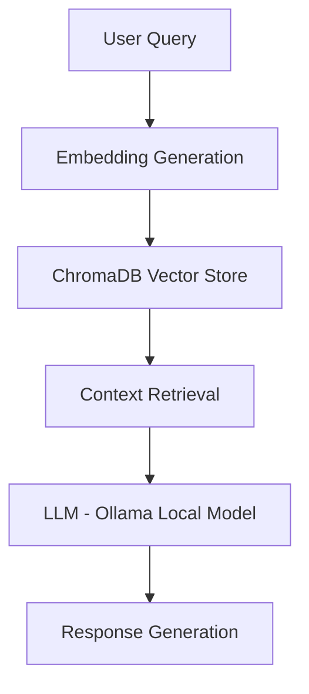

# 🚀 AI Agent System (Local LLM + RAG)

A **local-first AI agent framework** built using **Python, Ollama, LangChain, and ChromaDB** to enable **autonomous, context-aware workflows** — fully offline, cost-efficient, and privacy-preserving.

---

## 🔥 Why This Project Matters

Most AI applications rely on paid APIs and external services. This project demonstrates how to:

- Run **LLMs locally** (no API costs)
- Build **production-style RAG pipelines**
- Design **modular AI agents**
- Ensure **data privacy and low latency**

---

## 🧠 Core Capabilities

- Local LLM inference using **Ollama**
- **Retrieval-Augmented Generation (RAG)** pipeline
- Semantic search with **ChromaDB**
- Modular **agent orchestration**
- Context-aware multi-step execution
- Fully offline architecture

---

## 🏗️ System Architecture


---

## ⚙️ Tech Stack

- **Language:** Python  
- **LLM Runtime:** Ollama  
- **Framework:** LangChain  
- **Vector Database:** ChromaDB  

---

## 🚀 Getting Started

### 1. Clone the Repository
```bash
git clone https://github.com/JigeeshaJain/AI-Agent.git
cd AI-Agent
```


### 2. Set Up Virtual Environment
```bash
python -m venv venv
source venv/bin/activate      # Mac/Linux
venv\Scripts\activate         # Windows
```

### 3. Install Dependencies
```bash
pip install -r requirements.txt
```

### 4. Setup Ollama

Install Ollama

Download from: https://ollama.com/

Pull a Model
```bash
ollama pull llama2
```

## Run the Application

```bash
python3 main.py    #Mac/Linux
python main.py     #Windows
```

## 🔍 How It Works (RAG Flow)
1. User query is converted into embeddings
2. ChromaDB retrieves relevant context using semantic search
3. Context is passed to the LLM
4. LLM generates a context-aware response

## 💡 Use Cases
* Developer assistants
* Knowledge retrieval systems
* Offline AI applications
* Document-based Q&A systems

### 📊 Key Engineering Highlights
+ Local-first architecture → no API dependency
+ RAG pipeline implementation → improved accuracy
+ Vector search + embeddings → scalable retrieval
+ Modular design → extensible to multi-agent systems


